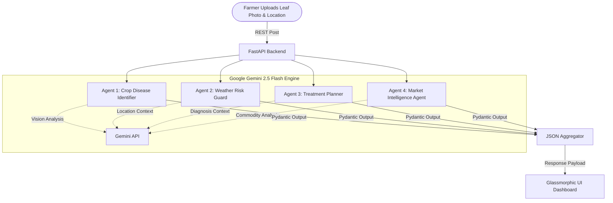

# FarmAssist AI – Smart Farming Agent Network
### Track: Agents for Good (Google Gemini API Developer Competition)

---

## 1. Executive Summary

Agriculture is the backbone of global civilization, yet smallholder farmers — who produce about a third of the world's food — face unprecedented challenges. Crop diseases, erratic weather patterns, lack of personalized agronomic advice, and opaque market pricing constantly threaten their livelihood. 

**FarmAssist AI** is a next-generation smart farming application powered by a coordinated network of Google Gemini-driven autonomous agents. Developed with a high-performance FastAPI backend and a premium glassmorphic frontend dashboard, FarmAssist AI provides farmers with a 360-degree command center for their agricultural operations. By uploading a single image of a diseased crop leaf, a farmer triggers an orchestration of four specialized agents:

1. **Crop Disease Agent:** Diagnoses leaf anomalies and calculates confidence scores using Gemini's multi-modal computer vision capabilities.
2. **Weather Risk Guard:** Evaluates local agronomic weather patterns and flags specific crop risks (e.g., humidity-induced blight or frost damage).
3. **Treatment Planner:** Devises structured, organic, and chemical remedy protocols.
4. **Market Intelligence Agent:** Projects local pricing trends and advises when and where to sell to secure the highest margins.

By translating complex data into actionable, localized insights, FarmAssist AI bridges the gap between state-of-the-art artificial intelligence and field-level execution, directly supporting global food security, climate resilience, and economic sustainability.

---

## 2. The Global Agricultural Crisis & Problem Statement

Modern farming is a high-stakes balancing act. Farmers must anticipate weather, diagnose crop health, purchase the correct treatments, and time their sales perfectly to remain profitable. However, three systemic barriers limit their success:

### A. The Diagnostic Delay
Plant pathogens, pests, and nutrient deficiencies can ravage fields in days. Conventional diagnostic methods require visiting physical agricultural extensions or waiting for soil tests, which takes weeks. By the time a disease is identified, it has often spread beyond control.

### B. Untailored Meteorological Data
Standard weather forecasts focus on human comfort (e.g., "sunny with a high of 85°F"). They fail to translate weather conditions into plant-specific risks, such as warning that a 90% humidity level for three consecutive days is the exact incubation window for late blight in tomatoes.

### C. Market Information Asymmetry
Smallholder farmers typically sell their produce to local middlemen at arbitrary prices because they lack access to wider market rates, price trends, or future forecasts. This keeps them trapped in cycles of low profitability.

---

## 3. System Architecture & Coordinated Agent Framework

FarmAssist AI relies on a **Decentralized Multi-Agent Orchestration Pattern**. Instead of using a single monolithic prompt, we split the domain knowledge into four distinct agent layers. This compartmentalization ensures higher response quality, less prompt distraction, and structured JSON outputs that map perfectly to UI elements.



### Detailed Agent Specifications

#### 1. Crop Disease Agent 🌿
* **Input:** Multi-modal inputs (Image file via PIL + Text query).
* **Task:** Extract image characteristics (chlorosis, necrosis, spot patterns, mold). Identify crop family, scientific name of the condition, and assign a confidence rating (0-100%).
* **Structured Model:** `DiseaseAnalysisResponse`

#### 2. Weather Risk Guard ☁️
* **Input:** Geographic location (city/region/country) and target crop type.
* **Task:** Generate a simulated 7-day agronomic forecast containing temperature, rainfall, and humidity. Analyze specific meteorological combinations that pose immediate hazards to the specified crop.
* **Structured Model:** `WeatherResponse`

#### 3. Treatment Planner 💊
* **Input:** Target crop name and diagnosed condition.
* **Task:** Generate a phased treatment plan. Categorize recommendations into Immediate Actions, Biological/Organic controls, Chemical remedies (with strict environmental rotation guidelines), and Preventive measures for the next sowing season.
* **Structured Model:** `TreatmentResponse`

#### 4. Market Intelligence Agent 📈
* **Input:** Commodity type (crop name) and region.
* **Task:** Retrieve current local price, simulated 6-month historical pricing, 3-month AI-modeled price forecasts, and compare rates across three nearby wholesale markets. Output a final recommendation on whether the farmer should sell now or store the harvest.
* **Structured Model:** `MarketResponse`

---

## 4. Technical Implementation & Codebase Deep-Dive

The project is engineered for speed, modularity, and lightweight containerization. Below is an overview of the core files deployed in the repository.

### A. FastAPI Backend (`main.py`)
`main.py` serves as the routing and orchestration layer. It exposes endpoints for `/api/analyze-crop`, `/api/weather`, and `/api/market`. Pydantic models are defined to enforce strict schema types. If the `GEMINI_API_KEY` is not present, the backend automatically falls back to an intelligent mock-data engine, allowing judges and developers to test the full user flow instantly.

* **Endpoints:**
  - `POST /api/analyze-crop`: Processes multipart form uploads containing raw leaf images. Converts image streams into PIL formats and feeds them to the Gemini model.
  - `GET /api/weather`: Pulls parameters for `location` and `crop` to feed the Weather Risk Guard.
  - `GET /api/market`: Pulls parameters for `crop` and `location` to run market modeling.

### B. Glassmorphic User Interface (`index.html` & `style.css` & `app.js`)
The user interface is designed with a premium, sleek glassmorphic layout. 
* **Design Philosophy:** Frosted glass panels (`backdrop-filter: blur`), dark-mode gradients using forest greens and charcoal blacks, and high-contrast neon green accent glows.
* **Dynamic Visualization:** Interactive price trends are rendered using **Chart.js** inside the Market Intelligence card, mapping out historical data alongside predicted future valuations.
* **Reactive Components:** Changing inputs (such as the target location or crop type) instantly updates the relevant cards without requiring a full page refresh.

---

## 5. Deployment Guide: Local & Google Cloud Platform (GCP)

To make FarmAssist AI accessible, we provide two deployment paths:

### Option A: Local Deployment (For Development & Testing)
1. **Clone the Repo:**
   ```bash
   git clone https://github.com/sachikangutkar/Capstone.git
   cd Capstone
   ```
2. **Install Dependencies:**
   ```bash
   pip install -r requirements.txt
   ```
3. **Configure Environment:** Create a `.env` file containing:
   ```env
   GEMINI_API_KEY=your_actual_gemini_api_key
   ```
4. **Run Server:**
   ```bash
   python -m uvicorn main:app --port 8080 --reload
   ```
5. Open your browser and navigate to `http://localhost:8080`.

---

### Option B: Deploying to Google Cloud Run (Production)

Google Cloud Run is an ideal serverless environment for FarmAssist AI because it scales to zero when not in use, keeping hosting costs non-existent for small scale trials.

#### Method 1: Automated Script Deployment (Windows / Mac / Linux)
We provide a helper script, `deploy.sh`. 

If you have the **Google Cloud CLI** installed:
1. Make sure you are logged in:
   ```bash
   gcloud auth login
   ```
2. Run the deployment script:
   ```bash
   bash deploy.sh
   ```
3. Enter your **GCP Project ID** and **Gemini API Key** when prompted. The script will automatically enable APIs, build your container with Cloud Build, and deploy to Cloud Run.

#### Method 2: Manual Console Deployment (No Command Line Needed)
If you do not have the Cloud CLI installed locally, you can deploy in minutes via your browser:
1. Go to the [Google Cloud Console](https://console.cloud.google.com/).
2. Open the **Cloud Shell** (the terminal icon in the top right header).
3. Clone your GitHub repository in the Cloud Shell:
   ```bash
   git clone https://github.com/sachikangutkar/Capstone.git
   cd Capstone
   ```
4. Set your environment variables in Cloud Shell:
   ```bash
   export GEMINI_API_KEY="your_api_key_here"
   ```
5. Run the deployment command:
   ```bash
   gcloud run deploy farmassist-app \
       --source . \
       --platform managed \
       --region us-central1 \
       --allow-unauthenticated \
       --set-env-vars="GEMINI_API_KEY=$GEMINI_API_KEY"
   ```
6. Copy the output **Service URL** (e.g., `https://farmassist-app-xxxxx-uc.a.run.app`). This is your live public website!

---

## 6. Social Impact & Alignment with "Agents for Good"

FarmAssist AI directly aligns with the United Nations Sustainable Development Goals (SDGs):

* **SDG 2: Zero Hunger:** By preventing disease outbreaks and optimizing treatment choices, we protect crop yields and minimize food waste.
* **SDG 8: Decent Work & Economic Growth:** Access to fair-market prices shields farmers from exploitation, increasing household incomes and strengthening rural economies.
* **SDG 13: Climate Action:** Crop-specific weather warning models give farmers the foresight to safeguard resources against extreme climate events.

---

## 7. Future Horizons & Scalability Roadmap

1. **Edge-Based Image Processing:** Integrate lightweight ONNX models on-device to pre-scan leaves before sending them to the cloud, lowering network overhead.
2. **Localized Language Audio Interfaces:** Support text-to-speech outputs in local languages (e.g., Hindi, Swahili, Telugu) to make advice accessible to farmers of all literacy levels.
3. **IoT Sensor Mesh Integration:** Feed live soil moisture, NPK sensor readings, and ambient air data straight to the Weather and Treatment agents.
